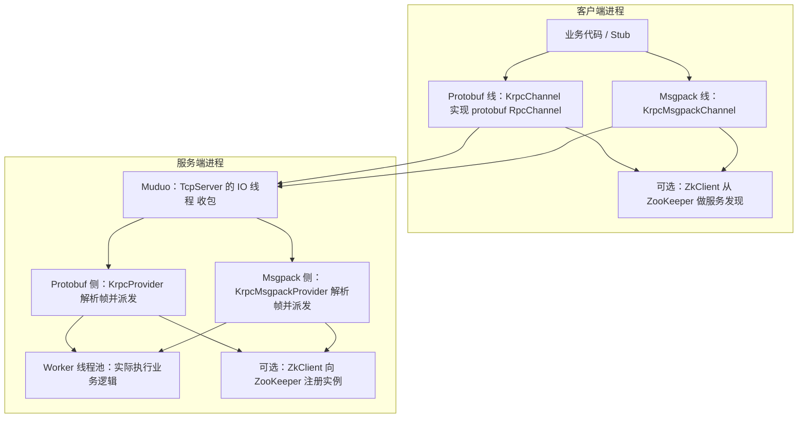

# 面试答辩材料：Krpc 的工程化与稳定性

> 使用场景：你需要在 5 分钟内把项目讲清楚，并回答“如果线上出问题你怎么定位/怎么保证稳定”的问题。
>
> 你可以把本页当作面试讲稿提纲；更细的实现与验证记录见：
> - 架构总览与模块职责：[Krpc/docs/项目说明书_架构与模块.md](项目说明书_架构与模块.md)
> - 工程化与稳定性演进：[Krpc/docs/工程化与稳定性完善计划.md](工程化与稳定性完善计划.md)
> - 阶段A基准结果（protobuf / msgpack 两张大表）：[Krpc/docs/阶段A_基准矩阵_实施与结果.md](阶段A_基准矩阵_实施与结果.md)
>

---

## 1. 30 秒项目概述（模板）

Krpc 是一个基于 Muduo Reactor 模型的 C++ RPC 框架，支持 `protobuf` 与 `msgpack` 两条编解码链路、ZooKeeper 服务发现（可跳过本地注册）、客户端异步调用（future/callback）、连接池与负载均衡，并提供 Prometheus 文本指标与心跳/空闲踢除等稳定性能力。

---

## 2. 架构图（给面试官看“一眼懂”的）

下面图里你需要重点口述：Client 如何发请求（帧头 + body）、Server IO 如何解帧、业务如何进入线程池、以及如何做发现与负载均衡。

你也可以直接讲这张图对应的内容（不展开细节）：

**读图**：左右两条竖线是 **Protobuf / Msgpack 两套编解码**；**ZkClient** 可关掉，改用环境变量静态端点；客户端通道与 **Muduo TcpServer** 之间是 **TCP**（长连或短连，口述即可）。

更详细的组件与数据流说明见：[Krpc/docs/项目说明书_架构与模块.md](项目说明书_架构与模块.md)。

---

## 3. 故障注入与稳定性演示（建议你现场跑一遍）

你不需要做“代码级故障注入”，用现有 demo 和配置就能演示线上常见故障模式。

### 3.1 心跳保活 + 空闲踢除（演示“连接仍然活着/坏了会被关掉”）

配置在 `bin/test.conf`：
- `heartbeat_interval_ms`
- `heartbeat_miss_limit`
- `rpc_timeout_ms`

步骤（按 README 原话演示）：
1. 启动服务端（终端 A）：`bin/server -i bin/test.conf`
2. 长时间心跳演示（终端 B）：
   `HEARTBEAT_IDLE_SECONDS=30 HEARTBEAT_IDLE_ROUNDS=2 bin/heartbeat_client -i bin/test.conf`
3. 观察服务端空闲踢除（终端 A）：
   约 `heartbeat_interval_ms × (heartbeat_miss_limit + 1)` 后出现 `closing idle connection`。

### 3.2 RPC 超时路径与重连（演示“坏请求不会拖死系统”）

步骤（终端 C）：
- `bin/timeout_client -i bin/test.conf`

预期：
- 正常请求成功；
- `sleep` 用户名的请求触发客户端自定义超时关闭；
- 服务端会打印类似 `Broken pipe`，验证超时路径不会影响心跳。

完整步骤见 README：[Krpc/README.md](README.md) 的“心跳与空闲连接测试指引”章节。

---

## 4. 与 gRPC 的对比（面试常问，给 3 句话即可）

1. 依赖栈与传输：gRPC 主要走 HTTP/2 + Proto schema，强调跨语言与生态；Krpc 通过自定义帧头解决 TCP 粘包拆包，并使用 Muduo 的 Reactor 模型，便于在纯 C++ 场景里做更底层的性能与行为控制。  
2. 可观测与扩展：gRPC 天生集成拦截器与中间件体系；Krpc 这边用 `RpcHeader`/日志与 metrics 做最小可观测能力，并预留 `trace_id` 作为上下文传播载体。  
3. 稳定性策略：gRPC 有成熟的超时/重试/连接管理实现；Krpc 通过心跳、超时、连接池、负载均衡与队列背压等机制形成“可解释的失败模式”，更适合面试官聚焦“工程稳定性怎么做”。  

---

## 5. 个人贡献清单（建议 4 条以内）

你可以把每条都用“问题 -> 设计 -> 验证”说清楚：

1. **可复现的稳定性基准叙事**：补齐 `BENCH_PAYLOAD_KB` 到 `1024`，并用阶段A跑出 protobuf/msgpack 两张结果大表（含 sync/async、keepalive/short、p50/p95/p99、成功率）。  
2. **可观测上下文 `trace_id`**：在 `Krpc` 的 Protobuf `RpcHeader` 中加入 `trace_id` 字段，让客户端到服务端的日志链路能对齐；并用单测验证序列化一致性与 controller reset 行为。  
3. **工程质量门禁**：引入 Catch2 单元测试，并提供“等价 CI”脚本 + CMake 开关（CI 只跑 tests，避免 Muduo/ZK 依赖），保证变更可回归。  
4. **本地压测/CI 更顺畅**：增加 `skip_zookeeper_registration`，让本地/CI 可以通过 `LB_STATIC_ENDPOINTS` 走稳定的离线压测路径。  

---

最后一句话收尾：
Krpc 的目标不是把功能堆到最多，而是把“延迟、失败模式、可观测性、回归验证”组织成一条完整的工程闭环。

