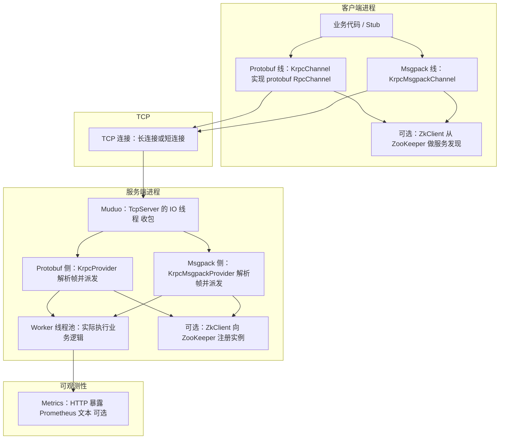

# Krpc 项目说明书：架构、模块与接口

> 面向需要快速接手、二次开发或排查问题的工程师。本文描述**当前仓库**中的目录布局、运行时架构、双协议路径、主要类职责与配置要点。  
> 更细的功能迭代记录见 [`feature_summary.md`](feature_summary.md)；工程化与稳定性规划见 [`工程化与稳定性完善计划.md`](工程化与稳定性完善计划.md)。

---

## 1. 文档目的与建议阅读顺序

| 读者目标 | 建议阅读 |
|----------|----------|
| 先跑通示例 | 第 11 节构建命令 + [`README.md`](../README.md) 中各 demo 段落 |
| 理解一次 RPC 从调用到返回 | 第 3～5 节架构与数据流 |
| 改客户端/服务端行为 | 第 6～8 节模块与接口 + 第 9 节配置 |
| 对接注册中心与多实例 | 第 10 节 ZK 模型 + [`load_balancer` 相关说明](#73-负载均衡与端点发现) |

---

## 2. 技术栈与外部依赖

| 类别 | 依赖 | 用途 |
|------|------|------|
| 语言 | C++11 | 全工程 |
| 网络 | Muduo（`muduo_net` / `muduo_base`） | Reactor、`TcpServer`、缓冲区 |
| 序列化 | Protobuf | 默认 RPC：`RpcHeader` + 业务 `*.proto` |
| 序列化（可选） | 项目内 Msgpack（`third_party/rpc`） | `rpc_codec=msgpack` 时的帧与参数 |
| 注册中心 | ZooKeeper C API（`zookeeper_mt`） | 服务注册与发现 |
| 日志 | glog | 可配置级别与输出 |
| 构建 | CMake | 顶层 [`CMakeLists.txt`](../CMakeLists.txt) 定义 `LIBS` 与子目录 |

单元测试（若开启 `KRPC_BUILD_TESTS`）使用 Catch2，通过 `FetchContent` 拉取，**不依赖 Muduo**，仅覆盖协议头等轻量逻辑。

---

## 3. 仓库目录结构（概览）

```
Krpc/
├── CMakeLists.txt          # 工程入口、全局链接库、tests 开关
├── src/                    # 框架核心静态库 krpc_core
│   ├── *.cc                # 实现（KrpcChannel、KrpcProvider、Msgpack 通道等）
│   ├── include/            # 对外头文件（Krpcchannel.h、Krpcprovider.h 等）
│   ├── Krpcheader.proto    # 通用 RPC 帧头（protobuf 线）
│   └── Krpcheader.pb.{cc,h}# protoc 生成代码
├── example/                # 示例：caller/callee、bench、async、timeout 等
├── bin/                    # 运行时配置样例（*.conf），可执行文件默认输出到此
├── third_party/            # 第三方（含 msgpack 头/源）
├── tests/                  # 单元测试（Catch2）
└── docs/                   # 设计说明与本说明书
```

---

## 4. 总体架构图

下图描述**逻辑分层**与主要组件关系（不区分 OS 线程细节）。



**要点**：

- 业务可通过 **Protobuf 生成的 Stub + `KrpcChannel`**，或 **`KrpcMsgpackChannel` 模板调用** 两种方式发 RPC。
- 服务发现：默认从 **ZooKeeper** 拉取 `/<Service>/<Method>` 下子节点（或节点数据中的 `ip:port`）；亦支持环境变量 **`LB_STATIC_ENDPOINTS`** 静态列表（见下文）。
- 服务端 IO 线程只做**收包与解析**，耗时逻辑在 **`KrpcProvider` / `KrpcMsgpackProvider` 的线程池**中执行（具体容量见配置）。

---

## 5. 端到端数据流（概念）

### 5.1 Protobuf 线

1. 客户端 `Stub->Method(controller, request, response, done)` → `KrpcChannel::CallMethod` / 异步路径 `CallFuture`。
2. 将 `RpcHeader`（varint 长度前缀 + protobuf 序列化）与请求 body 序列化后写入 TCP（发送侧可有 `writev` 聚合等优化）。
3. 服务端 `KrpcProvider::OnMessage` 在 `muduo::Buffer` 上循环解析：varint → `RpcHeader` → 读取 `body_size` 字节 → 反序列化请求 → `Service::CallMethod` → `SendRpcResponse`。
4. 响应同样为 `RpcHeader`（`MSG_TYPE_RESPONSE`）+ body。

### 5.2 Msgpack 线

1. 客户端 `KrpcMsgpackChannel::Call` / `CallAsyncRaw` 等将 `(MsgpackHeader, 参数 tuple)` msgpack 打包，前加 **4 字节大端长度** 作为帧。
2. 服务端 `KrpcMsgpackProvider::OnMessage` 读长度 + payload → 分发到 `KrpcMsgpackDispatcher` 注册的 lambda / 处理器。
3. 响应帧结构对称，由 provider 写回连接。

### 5.3 心跳

- Protobuf 线使用 `RpcHeader` 中 `MSG_TYPE_PING` / `MSG_TYPE_PONG`。
- Msgpack 线使用 `MsgpackMsgType::Ping` / `Pong`。
- 客户端有心跳线程；服务端可基于空闲时间踢连接（见配置与 `feature_summary`）。

---

## 6. 核心模块说明

### 6.1 应用与配置

| 模块 | 文件（主要） | 职责 |
|------|----------------|------|
| `KrpcApplication` | [`Krpcapplication.h`](../src/include/Krpcapplication.h)、`Krpcapplication.cc` | 单例；`Init(argc,argv)` 解析 `-i <conf>`，加载 `Krpcconfig`，初始化 glog |
| `Krpcconfig` | [`Krpcconfig.h`](../src/include/Krpcconfig.h)、`Krpcconfig.cc` | 键值对配置文件读取 |

### 6.2 客户端（Protobuf）

| 模块 | 职责 |
|------|------|
| `KrpcChannel` | 实现 `google::protobuf::RpcChannel`；ZK/缓存发现、**轮询负载均衡**、连接池、同步/异步（`CallAsync` / `CallAsyncFuture`）、心跳、`pending` 与超时管理、发送队列等 |
| `Krpccontroller` | 继承 `RpcController`：失败原因、**超时毫秒**、可选 **`trace_id`**（写入 `RpcHeader.trace_id`） |

### 6.3 客户端（Msgpack）

| 模块 | 职责 |
|------|------|
| `KrpcMsgpackChannel` | 模板 `Call` / `CallWithTimeout` / `CallAsyncRaw` / `Notify`；独立 recv/send/心跳/超时线程模型；同样支持发现、LB、连接池 |

### 6.4 服务端（Protobuf）

| 模块 | 职责 |
|------|------|
| `KrpcProvider` | `NotifyService(Service*)` 注册；`Run()` 启动 `TcpServer`；**ZK 注册**（可配置跳过）；`OnMessage` 解析帧；**任务队列 + Worker 池**执行 `CallMethod`；心跳与空闲管理；metrics 钩子 |

### 6.5 服务端（Msgpack）

| 模块 | 职责 |
|------|------|
| `KrpcMsgpackProvider` | `Bind(service, method, handler)`；`Run()`；解析 msgpack 帧；线程池；metrics；ZK（可配置跳过） |
| `KrpcMsgpackDispatcher` | 将 `(service, method)` 映射到注册的回调 |

### 6.6 公共与基础设施

| 模块 | 职责 |
|------|------|
| `ZkClient` | 连接 ZK、`Create`/`GetData`/`GetChildren` |
| `ILoadBalancer` / `RoundRobinLoadBalancer` | 多节点时轮询选择 |
| `metrics_export` / `metrics_http_server` | 进程内聚合 + 可选 HTTP `/metrics`（Prometheus 文本） |
| `KrpcLogger` | glog 封装 |

---

## 7. 对外接口与扩展点

### 7.1 Protobuf 业务接口

- 使用 `.proto` 定义 `service`/`rpc`，`protoc` 生成 `Stub` 与 `Service` 基类。
- **服务端**：实现生成的 `Service` 子类，将实例传给 `KrpcProvider::NotifyService`。
- **客户端**：构造 `KrpcChannel`，创建 `Stub`，调用生成的 RPC 方法。

异步：`KrpcChannel::CallAsync` 或 `CallAsyncFuture`（见头文件注释）。

### 7.2 Msgpack 业务接口

- **服务端**：`KrpcMsgpackProvider::Bind("ServiceName", "MethodName", lambda)`，参数与返回值类型需与客户端约定一致（见 `example/msgpack_demo`）。
- **客户端**：`KrpcMsgpackChannel::Call<R>(...)` 或异步 `CallAsyncRaw`。

### 7.3 负载均衡与端点发现

- **动态发现**：`KrpcChannel` / `KrpcMsgpackChannel` 通过 `ZkClient` 访问路径形如 **`/<ServiceName>/<MethodName>`** 的子节点列表（或兼容旧格式：方法节点上直接存 `ip:port`）。端点列表有**进程内 TTL 缓存**（见 `feature_summary`）。
- **静态列表**：环境变量 **`LB_STATIC_ENDPOINTS`**，格式 `ip:port,ip:port,...`，解析一次后优先使用，**不依赖 ZK**（适合本地压测）。

### 7.3 编解码选择

- 配置文件项 **`rpc_codec`**：`protobuf`（默认）或 `msgpack`（大小写不敏感，见 [`example/common/codec_util.h`](../example/common/codec_util.h)）。
- **客户端与服务端必须使用相同 codec**，否则帧格式不匹配。

---

## 8. 协议与数据结构要点

### 8.1 `Krpc::RpcHeader`（Protobuf，[`Krpcheader.proto`](../src/Krpcheader.proto)）

| 字段 | 含义 |
|------|------|
| `magic` / `version` | 魔数 `0x6b727063`（`'krpc'`）与版本，用于校验 |
| `msg_type` | Request / Response / Ping / Pong / Oneway 等 |
| `request_id` | 请求关联 ID（异步多路复用） |
| `body_size` | 紧随其后的业务 body 长度 |
| `compress_type` | 预留压缩类型 |
| `service_name` / `method_name` | 路由 |
| `trace_id` | 可选，日志关联 |

帧布局：**varint(Protobuf 序列化后的 header 长度) + RpcHeader 字节 + body**。

### 8.2 Msgpack 帧（[`Krpcmsgpack_protocol.h`](../src/include/Krpcmsgpack_protocol.h)）

- 头部 `MsgpackHeader`：`magic`、`version`、`msg_type`、`request_id`、`timeout_ms`、`service_name`、`method_name`（`MSGPACK_DEFINE`）。
- 线格式：**uint32 大端长度 + msgpack 负载**。

### 8.3 协议常量（[`Krpcprotocol.h`](../src/include/Krpcprotocol.h)）

- 默认心跳间隔、超时、版本等常量定义，供配置默认值或逻辑参考。

---

## 9. 配置项（常见键）

配置文件为 **`key=value`** 行，通过 **`程序名 -i <path>`** 加载。以下为开发/演示中常见项（完整列表以仓库内 `bin/*.conf` 与 [`README.md`](../README.md) 为准）。

| 键 | 含义（摘要） |
|----|----------------|
| `rpcserverip` / `rpcserverport` | 服务端监听地址 |
| `zookeeperip` / `zookeeperport` | ZK 地址 |
| `rpc_codec` | `protobuf` 或 `msgpack` |
| `skip_zookeeper_registration` | 若为 `1`，服务端跳过向 ZK 注册（本地压测时常用；客户端需 `LB_STATIC_ENDPOINTS`） |
| `rpc_timeout_ms` | 默认 RPC 超时（毫秒） |
| `heartbeat_interval_ms` / `heartbeat_miss_limit` | 心跳与失败阈值 |
| `enable_connection_pool` / `connection_pool_max_idle` | 客户端连接池 |
| `lb_fail_cooldown_ms` | 负载均衡失败端点冷却时间 |
| `provider_worker_threads` / `provider_queue_capacity` | 服务端线程池与队列（名称以实际 conf 为准） |
| `metrics_http_enabled` / `metrics_http_port` | Prometheus 文本导出 |
| `log_minlevel` / `logtostderr` / `colorlogtostderr` | glog 行为 |

---

## 10. ZooKeeper 注册模型（典型）

- 对每个 **Service**，创建持久路径：`/<ServiceName>`。
- 对每个 **Method**，创建持久路径：`/<ServiceName>/<MethodName>`。
- 每个**实例**在方法路径下创建 **临时顺序/子节点**，节点名或数据携带 **`ip:port`**，便于客户端 `GetChildren` 得到多副本列表。

客户端侧轮询与失败冷却与 `KrpcChannel` / `KrpcMsgpackChannel` 内逻辑配合，详见 [`feature_summary.md`](feature_summary.md) 负载均衡章节。

---

## 11. 示例程序索引

| 目录 | 作用 |
|------|------|
| `example/callee` + `example/caller` | 经典服务端 / 客户端，`user.pb.h` |
| `example/bench_demo` | 压测：`BENCH_MODE`、`BENCH_CONN`、`BENCH_PAYLOAD_KB` 等环境变量 |
| `example/async_demo` | 异步 future / callback |
| `example/timeout_demo` | 超时 |
| `example/heartbeat_demo` | 心跳与空闲 |
| `example/pool_demo` | 连接池 |
| `example/msgpack_demo` | Msgpack 专用演示 |
| `example/switch_demo` | 序列化切换相关示例 |

---

## 12. 构建与运行（摘要）

```bash
cmake -S . -B build -DCMAKE_BUILD_TYPE=Release
cmake --build build -j
# 可执行文件默认在 bin/（见各 target 的 RUNTIME_OUTPUT_DIRECTORY）
```

运行任一程序：**必须**带 `-i <配置文件>`。  
压测或本地无 ZK 时：使用带 `skip_zookeeper_registration=1` 的配置，并在客户端设置 **`LB_STATIC_ENDPOINTS=127.0.0.1:<port>`**。

---

## 13. 环境变量（客户端常用）

| 变量 | 用途 |
|------|------|
| `LB_STATIC_ENDPOINTS` | 静态 `ip:port` 列表，跳过 ZK 发现 |
| `KRPC_TRACE_ID` | Protobuf 路径下可选注入 trace（与 controller 中 `trace_id` 优先级逻辑以源码为准） |

Bench 相关：`BENCH_MODE`、`BENCH_CONN`、`BENCH_CONCURRENCY`、`BENCH_REQUESTS`、`BENCH_PAYLOAD_KB`、`BENCH_SLEEP_MS` 等（见 `example/bench_demo/BenchClient.cc`）。

---

## 14. 延伸阅读

- [`feature_summary.md`](feature_summary.md)：已实现特性清单与验证命令  
- [`async_design.md`](async_design.md) / [`async_patterns.md`](async_patterns.md)：异步设计  
- [`工程化与稳定性完善计划.md`](工程化与稳定性完善计划.md)：从工程视角的演进建议  
- [`README.md`](../README.md)：面向使用者的功能说明与操作步骤  

---

*文档版本：与当前仓库结构同步；若目录或类名变更，请同步更新本节与 `feature_summary.md`。*
